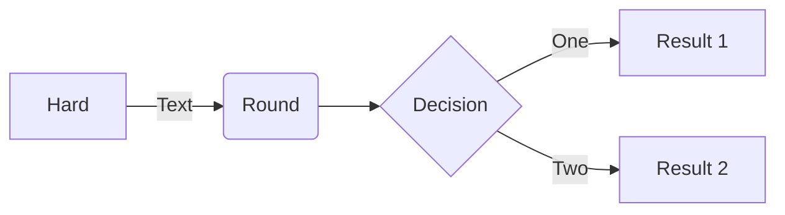
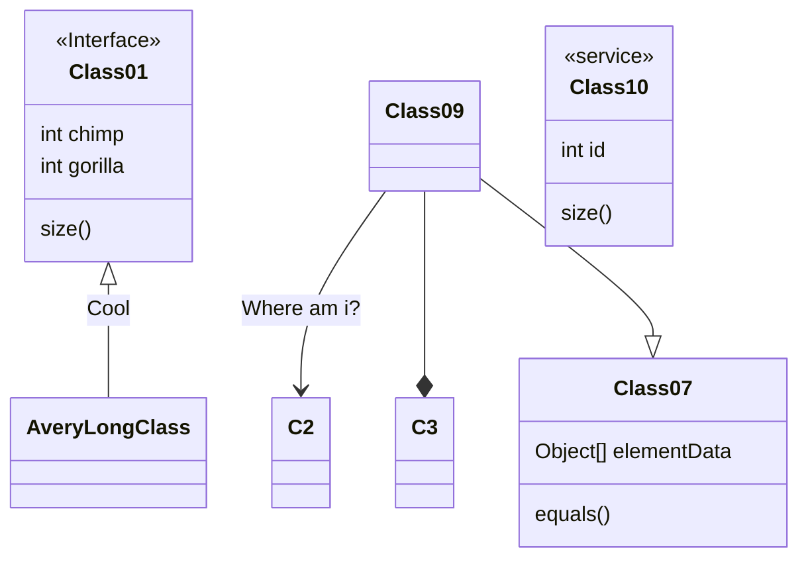
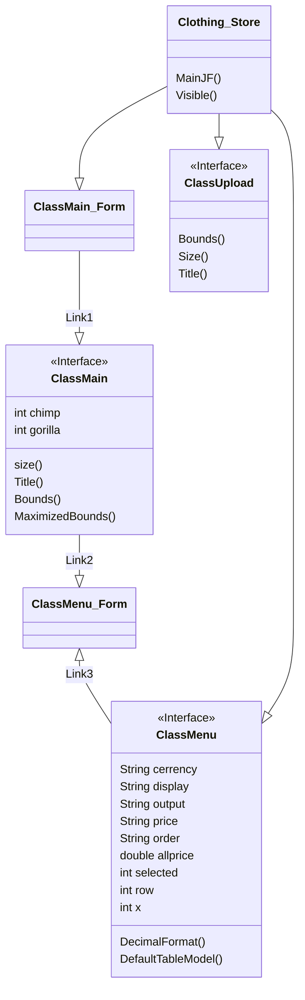

# Project-Save-to-CSV-and-DrinkWater.
> * My first project with JAVA, This work my old project in March 2021
> * พัฒนาโดย (Programing): นายกวินภพ ชมนิกร 

```mermaid
flowchart LR
A[Hard] -->|Text| B(Round)
B --> C{Decision}
C -->|One| D[Result 1]
C -->|Two| E[Result 2]
```

```mermaid
classDiagram
Class01 <|-- AveryLongClass : Cool
<<Interface>> Class01
Class09 --> C2 : Where am i?
Class09 --* C3
Class09 --|> Class07
Class07 : equals()
Class07 : Object[] elementData
Class01 : size()
Class01 : int chimp
Class01 : int gorilla
class Class10 {
  <<service>>
  int id
  size()
}
```

```mermaid
classDiagram

ClassMain_Form --|> ClassMain : Link1
ClassMain --|> ClassMenu_Form : Link2
ClassMenu_Form <|-- ClassMenu : Link3
<<Interface>> ClassMain
Clothing_Store --|> ClassMain_Form
Clothing_Store --|> ClassMenu
Clothing_Store --|> ClassUpload
Clothing_Store : MainJF()
Clothing_Store : Visible()
ClassMain : size()
ClassMain : Title()
ClassMain : Bounds()
ClassMain : MaximizedBounds()
ClassMain : int chimp
ClassMain : int gorilla
<<Interface>> ClassMenu
ClassMenu : String cerrency
ClassMenu : String display
ClassMenu : String output
ClassMenu : String price
ClassMenu : String order
ClassMenu : DecimalFormat()
ClassMenu : double allprice
ClassMenu : int selected
ClassMenu : int row
ClassMenu : int x
ClassMenu : DefaultTableModel()
<<Interface>> ClassUpload
ClassUpload : Bounds()
ClassUpload : Size()
ClassUpload : Title()

```
